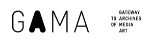

**IMPORTANT: The Gama Gateway project was finished in 2009 and is not maintained anymore!**

# Gama Gateway RDF Repository 

However, the RDF-Repository developed through the Gama Gateway project is a self-contained application that might be interesting also from outside of the Gama Gateway community.
It consists of the following components:
 * **GamaLib**: Code shared also by other components in the Gama Gateway project.
 * **GamaRepository**: Code specific to the RDF-repository.
 * **GamaSchema**: Metamodel used in the Gama Gateway project.
 * **GamaSync**: A set of scripts (simple REST api) that implements update of the repository content.
 * **GamaLevenshtein**: MySQL UDF extensions for computing Levenshtein distance.

## Other links
* Last known URL of the running Gama Gateway portal: http://www.gama-gateway.eu/
* Original SVN repository hosted at Google Code https://code.google.com/p/gama-gateway/
* Gama Gateway as an EU-funded project: http://ec.europa.eu/information_society/apps/projects/factsheet/index.cfm?project_ref=ECP-2006-DILI-510029
