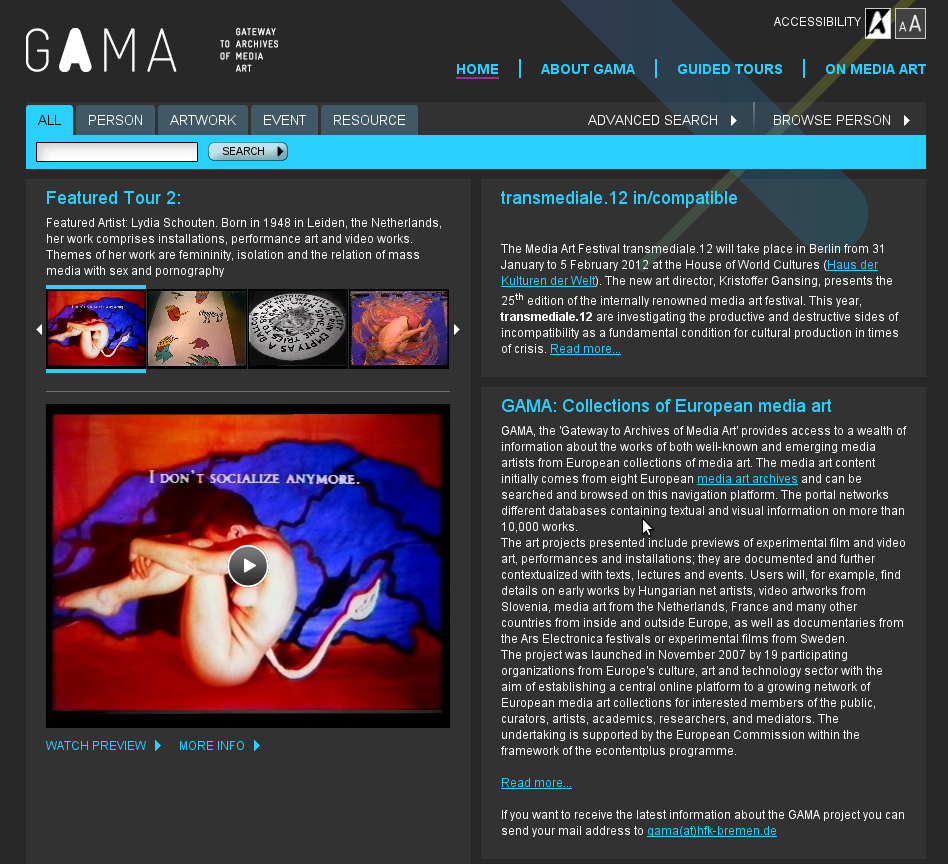
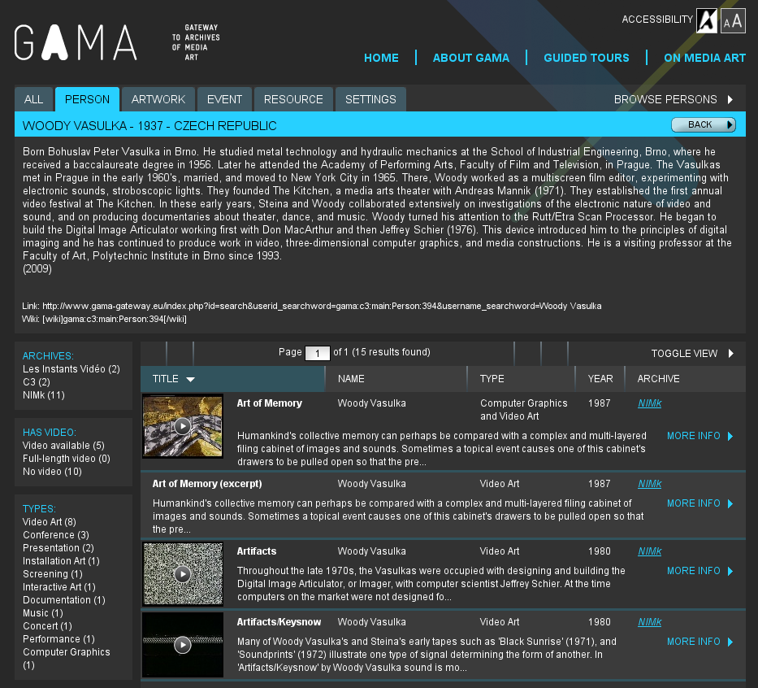
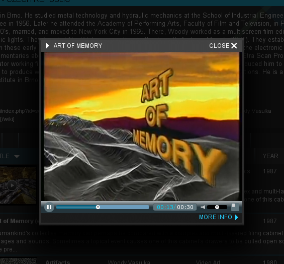
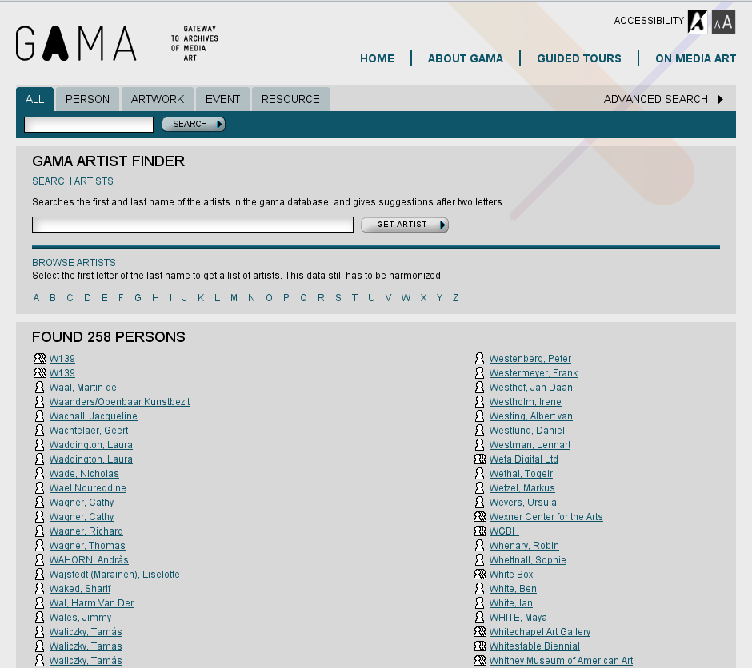
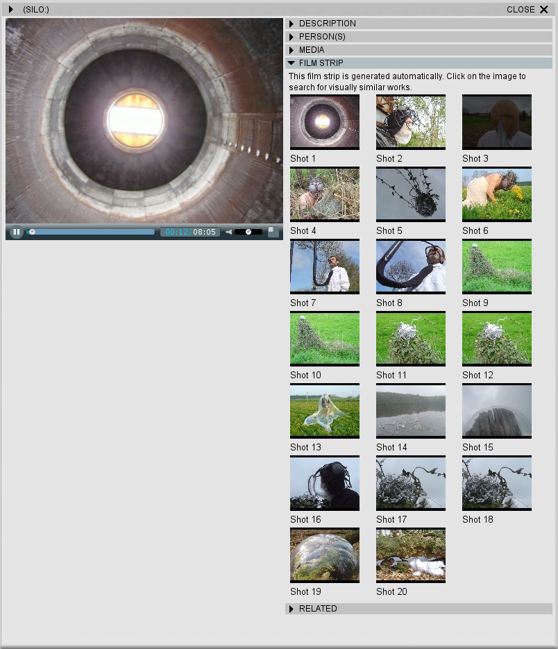
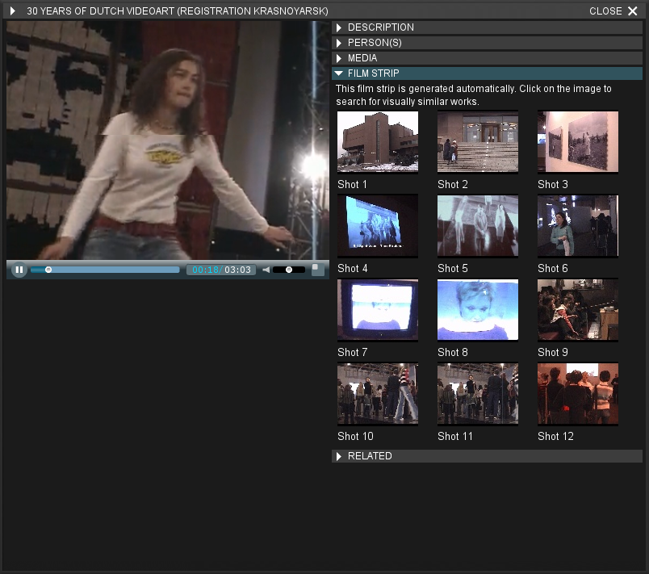

**IMPORTANT: The Gama Gateway project was finished in 2009 and is not maintained anymore!**

# Gama Gateway RDF Repository 

However, the RDF-Repository developed through the Gama Gateway project is a self-contained application that might be interesting also from outside of the Gama Gateway community.
It consists of the following components:
 * [**GamaLib**](GamaLib/): Code shared also by other components in the Gama Gateway project.
 * [**GamaRepository**](GamaRepository/): Code specific to the RDF-repository.
 * [**GamaSchema**](GamaSchema/): Metamodel used in the Gama Gateway project.
 * [**GamaSync**](GamaSync/): A set of scripts (simple REST api) that implements update of the repository content.
 * [**GamaLevenshtein**](GamaLevenshtein/): MySQL UDF extensions for computing Levenshtein distance.

The Gama schema is modeled in OWL using a RDF/XML notation.
* [**Download schema-base.owl**](https://raw.githubusercontent.com/vsimko/gama-gateway/master/GamaSchema/schema-base.owl)
  or
  [**visualize using WebVOWL**](http://visualdataweb.de/webvowl/#iri=https://raw.githubusercontent.com/vsimko/gama-gateway/master/GamaSchema/schema-base.owl)

## Screenshots from the last running instance

## Other links (some of them might not work anymore)
* Last known URL of the running Gama Gateway portal: http://www.gama-gateway.eu/
* Gama Gateway as an EU-funded project: **ECP-2006-DILI-510029**
* https://www.researchgate.net/publication/255572406_Accessing_Media_Art_via_the_GAMA_Portal
* http://www.infomus.org/Events/proceedings/UCMedia2009/pdf/paper8303.pdf
